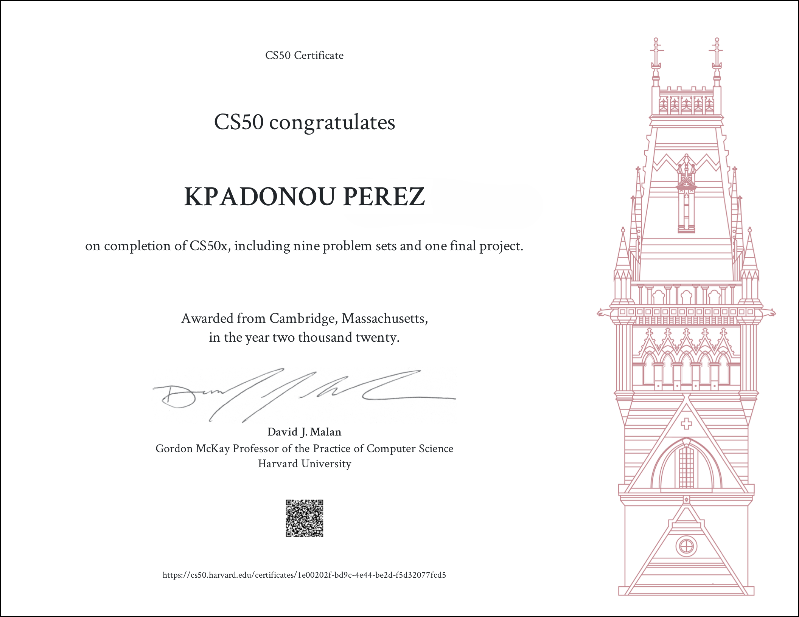

# Projects_CS50x 
Projects in C, or Python, JavaScript, HTML, CSS

# Projects_CS50x (Part_2)
Projects in Python, JavaScript, SQL, HTML, CSS (No C projects)

# CS50x: Introduction to Computer Science (HarvardX, 2020)
**Completed in Septembre 2020**

## Overview
This repository contains the second half of my [HarvardX's CS50x 2020](https://cs50.harvard.edu/college/2020/fall/syllabus/) programming projects. 
I developed practical coding skills through weekly problem sets and a Final Project, using C, Python, SQL, and JavaScript. 

**⚡ Languages Covered**
- This repository (Part 2) contains the projects in: **Python, SQL, JavaScript, HTML, CSS**

- Another repository (Part 1) contains the projects in: **C**

**Topics covered** 

📚 Topics Covered in this second part include: (Weeks 6-10)

## Contents

- `pset6`: [Mario Pyramid generator (in Python)](/%20Mario%20Pyramid%20generator%20(in%20Python)%20–%206.2./); [Cash Coin change (in Python)](/%20%20Cash%20Coin%20change%20(in%20Python)%20–%20%206.3./); [Readability Level estimator (in Python)](/%20%20%20Readability%20Level%20estimator%20(in%20Python)%20–%20%206.4./); [DNA Profiling (in Python)](/%20%20%20%20DNA%20Profiling%20(in%20Python)%20–%206.5./)
- `pset7`: [Movie Database querying (in SQL)](/%20%20%20%20%20Movie%20Database%20querying%20(in%20SQL)%20–%207.1./); [Hogwarts House queries (in Py and SQL)](/%20%20%20%20%20%20Hogwarts%20House%20queries%20(in%20Py%20and%20SQL)%20–%207.2./)
- `pset8`: Homepage Basic website (in HTML, CSS, and JavaScript)
Website with Flask and JavaScript (Web)
- `final_project`: [Project Name/Description]

## Certificate

